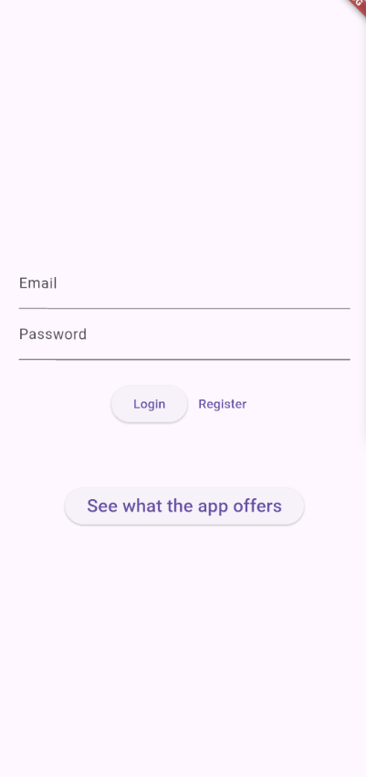
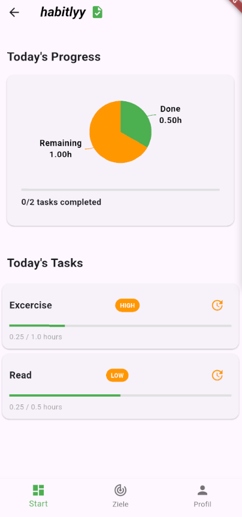
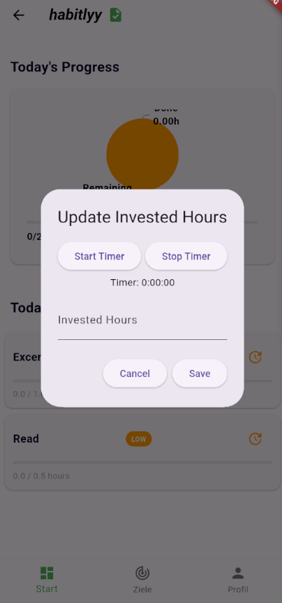
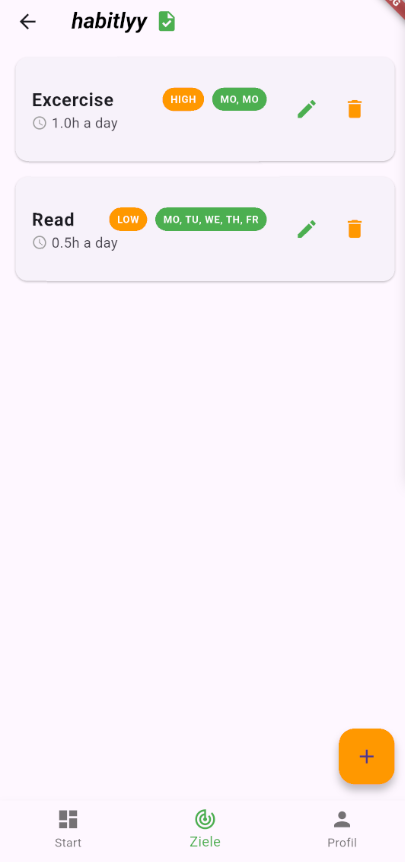
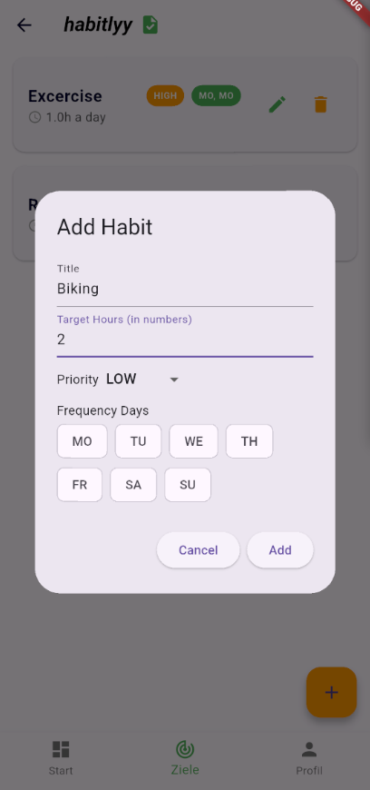
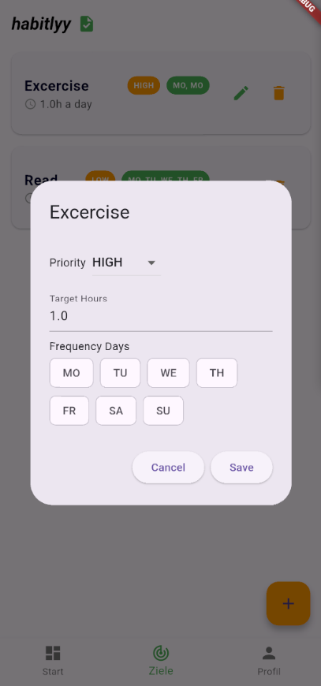
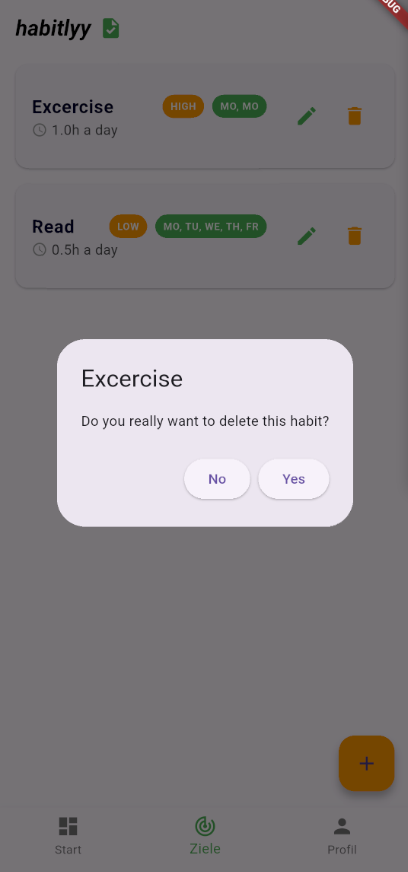
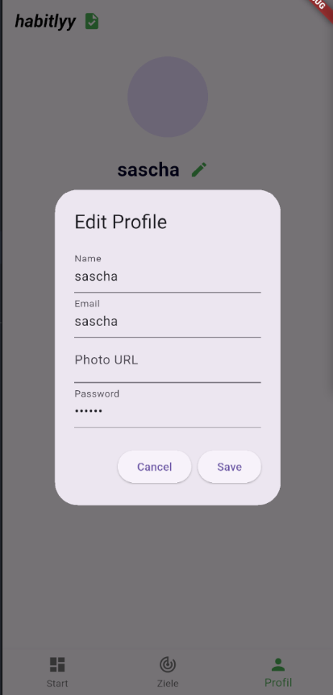

# ***habitlyy***

***habitlyy*** is a minimalistic Android app designed to help users set, manage, and
achieve their personal habits. The app focuses on simplicity and motivation,
making it easy to stay consistent and track progress over time.

Features:

    Create Habits:
    Add habits with time-based targets to track your progress effectively.

    Progress Dashboard:
        Visualize your achievements with an intuitive graph showing completed habits and overall progress.
        View a detailed list of active habits, with percentage completion and progress bars.

    Habit Management:
        Time-based habits: Log hours spent and compare them to your target.

    User Account:
        Manage basic profile information.
        Log out or customize app settings (e.g., reminders).

Minimal Design:

    Inspired by stock portfolio apps, habitlyy uses a clean and modern interface
    to keep your habits at the center of attention.

    Stay focused, track progress, and accomplish more with habitlyy!

## Technologies & Dependencies

- Database — `sqflite` (mobile) and `sqflite_common_ffi` (desktop): local SQLite storage for users and habits (tables created in `lib/database/database_helper.dart`). `sqflite_common_ffi` is initialized on desktop so the same database code works across platforms.
- Database paths & file ops — `path`: used to build platform-correct filesystem paths (e.g. database file path joins).
- Dependency injection / service locator — `get_it`: used for wiring the app services, repositories and the `DatabaseHelper` via `lib/service_locator.dart`.
- State management — `provider`: `ChangeNotifier`-based state containers (e.g. `providers/habit_provider.dart`) and wiring into the widget tree.
- Localization / i18n — `intl`, `flutter_localizations` and `flutter_intl` (codegen): app translations and locale-specific formatting (ARB files in `lib/l10n` and generated code in `lib/generated`).
- Charts / visualization — `syncfusion_flutter_charts`: renders the progress/analytics graphs on the dashboard.
- Small UI helpers — `smooth_page_indicator`: onboarding/showcase page indicators; `cupertino_icons` for iOS-style icons.
- Persistent simple settings — `shared_preferences`: stores small key/value data such as simple preferences or lightweight cached values.
- Code generation & testing — `build_runner`, `flutter_gen`: used for code-generation tasks (intl, assets, etc.); `mockito` for unit test mocks.

## Login

## Home

## Update Times

## Goals

## Adding Habits

## Editing Habits

## Delete Habits

## Profile

